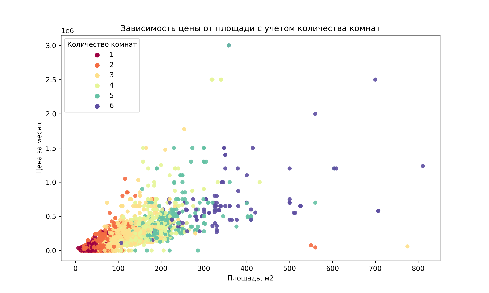

# Введение
В нашем проекте содержится датасет с информацией о квартирах в Москве, полученной с площадки "Циан". Он включает разнообразные данные о квартирах, которые будут использованы для обучения моделей машинного обучения.

# Структура проекта
Данные представлены в виде таблицы, где каждая строка соответствует одному объявлению о квартире на площадке. Всего в датасете содержится 19737 строк и 21 столбец.

# Работа над проектом
На данном этапе мы проводим подготовку данных для разработчиков моделей машинного обучения. Они будут использовать эти данные для обучения моделей, которые будут предсказывать стоимость аренды квартир в Москве.

# Ход нашей работы
*1*. Анализ имеющихся данных. Начальный анализ позволил нам определить нужные и лишние признаки, а также провести предварительный анализ с помощью графиков, что отражено в файле EDA.html.

*2*. Препроцессинг данных. Мы провели очистку данных, заполнили пропущенные значения и создали новые признаки для лучшего обучения моделей. Также мы заменили категориальные признаки числовыми для дальнейшего обучения.

*3*. Финальный коммит. На этом этапе мы удалили все дубликаты и оставили только числовые признаки типа int и float, готовые для дальнейшей работы с моделями.

# Вывод

Из проведенного анализа данных видно, что квартиры в Москве имеют различное расположение по этажам, от самых высоких до подземных. Средняя этажность квартир составляет около 7, однако половина из них располагается ниже 6 этажа. Большинство квартир имеют ремонт, причем значительная часть из них обустроена с евроремонтом или косметическим ремонтом.

По станциям метро можно выделить несколько популярных районов с большим количеством квартир в аренду: Селигерская, Щелковская, Бабушкинская, Новогиреево, Коломенская. Интересно, что значительная часть квартир разрешает проживание с детьми (около 15000 объявлений) и с животными (около 6000 объявлений).

Основной вывод состоит в том, что цена квартиры существенно зависит от ее площади. Это подтверждает важность учета площади при определении стоимости аренды квартиры в Москве.

  

  

